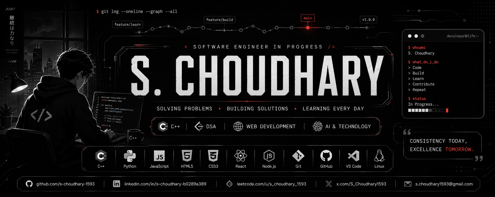

<div align="center">



<a href="https://github.com/s-choudhary-1593">

</a>

<br/><br/>


</div>

<br/>

## 👨🏻‍💻 About Me

```cpp
class Developer {
public:
    string name = "S. Choudhary";
    string role = "Software Engineer";

    vector<string> interests = {
        "C++", "DSA", "Web Dev", "AI"
    };

    void life() {
        while (alive) {
            Learn(); Build(); Debug(); Repeat();
        }
    }
};
```

<br/>

## 🛠 Tech Stack

<div align="center">


</div>

<br/>

## 🚀 Current Focus

<div align="center">

| 🧩 DSA | 🏗️ Projects | 🌐 Full Stack | 🤖 AI | 🔓 Open Source |
|:---:|:---:|:---:|:---:|:---:|
| 150 Sheet | Shipping | Mastering | Exploring | Contributing |

</div>

<br/>

## 📊 GitHub Stats

<div align="center">


<br/>


<br/>


</div>

<br/>

## 📈 Skill Progress

```text
C++                ████████████████░░░░  80%
DSA                ███████████████░░░░░  75%
HTML / CSS         █████████████░░░░░░░  65%
JavaScript         ██████████░░░░░░░░░░  50%
React              ███████░░░░░░░░░░░░░  35%
Node.js            ██████░░░░░░░░░░░░░░  30%
AI                 ████░░░░░░░░░░░░░░░░  20%
```

<br/>

## 🎯 2026 Goals

- [x] Complete 150 DSA Sheet
- [ ] Build 5+ production-level projects
- [ ] Master full stack development
- [ ] Learn AI integration
- [ ] Secure a software engineering internship
- [ ] Contribute to open source

<br/>

## 📂 Featured Repositories

<div align="center">

<a href="https://github.com/s-choudhary-1593/150-Sheet">

</a>
<a href="https://github.com/s-choudhary-1593/LeetCode">

</a>

</div>

<br/>

## 🌐 Connect With Me

<div align="center">

<a href="https://leetcode.com/u/s_choudhary_1593/">

</a>
<a href="https://www.linkedin.com/in/s-choudhary-b0289a389">

</a>
<a href="https://x.com/S_Choudhary1593">

</a>
<a href="mailto:s.choudhary1593@gmail.com">

</a>

</div>

<br/>

<div align="center">

### 💭 *"Consistency Today. Excellence Tomorrow."*


</div>
